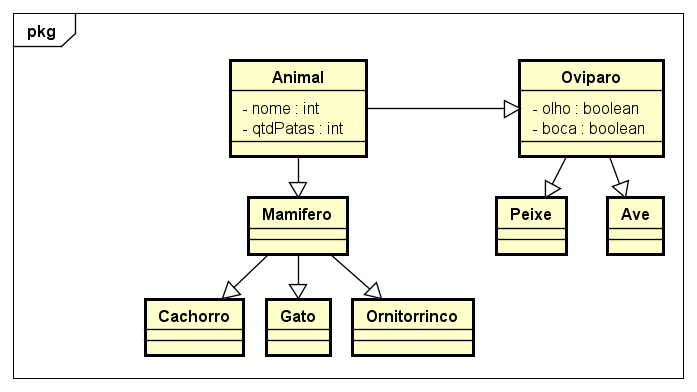
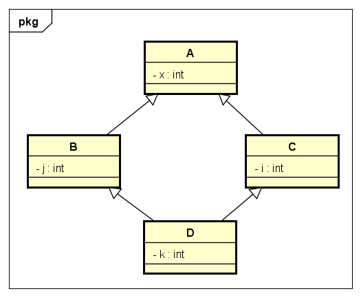

# Herança e Construtor

Exercícios de Programação Orientada a Objetos para a prática do conceito de Herança e Construtor.

## Exercícios
#

**1** - Escreva uma hierarquia de classes envolvendo as seguintes classes: Figura, Quadrado, Retangulo, Circulo, Losango e Trapézio. Figura deve ser superclasse de todas. Todas as demais devem herdar diretamente de Figura.

**2** - Refine a solução do Exercício 1. Agora devem existir as classes Figura2D e Figura 3D. Ambas (e somente elas) herdam diretamente de Figura. As demais devem todas herdar de Figura2D, de Figura3D ou ainda de alguma outra. Devem existir também as classes Quadrilatero, Cubo e Esfera.

**3** - Escreva uma hierarquia de classes para representar animais. Deve haver uma classe Animal que define o nome e a quantidade de patas do animal. Ela deve ter três construtores: o padrão, um que recebe uma string a ser atribuída ao nome do animal e um terceiro que recebe o número de patas e o nome. Escreva uma classe chamada Mamifero que herda de Animal. Ela deve ter um construtor somente. Ele recebe o nome e a quantidade de patas do Animal e os repassa para o construtor da superclasse. Escreva duas classes chamadas Cachorro e Gato que herdam de Mamifero. Ambas definem um único construtor que recebe o nome do Animal e repassa para a superclasse. Internamente, ambos devem repassar o valor 4 como quantidade de patas.

**4** - Escreva uma classe de Teste que instancia um Cachorro e um Gato.

**5** - Escreva uma classe chamada Oviparo. Pesquise sobre animais oviparos e encaixe dois tipos de oviparos como subtipo de Oviparo. Coloque dois atributos em Oviparo que sejam comuns a todos os oviparos.

**6** - Considere a classe Ornitorrinco. Embora sejam considerados oviparos, as fêmeas produzem leite e poderiam ter características de interesse já definidas na classe mamífero. Responda: De qual classe Ornitorrinco deveria herdar?

    O Ornitorrinco se manteria na herança de mamífero, porque Ele é um mamífero porque, apesar de ser ovíparo, possui glândulas mamárias e é um animal de sangue quente (endotérmicos). 

**7** - Faça um diagrama de classes que mostra todas as classes da hierarquia de animais, incluindo ornitorrinco. Lembre-se: no Java só existe herança simples. Isso quer dizer que uma classe só pode herdar diretamente de uma única classe.

**8** - Faça uma pesquisa sobre o fenômeno conhecido como Deadly Diamond of Death e escreva cinco linhas sobre ele. Faça um diagrama de classes em que ele aparece.

    Na programação orientada a objetos, o “Deadly Diamong of Death” é um problema que ocorre na herança de classe, quando temos duas classes que herdam de uma superclasse, mas também possuem uma classe filha em comum. Este problema ocorre quando há um método na superclasse, as duas classes que herdam da superclasse geram uma ambiguidade para a classe filha, ao qual acaba não conseguindo distinguir de quem herdar. Para contornar essa situação, as duas classes filhas que herdam da superclasse poderiam se tornar interfaces ou apenas uma delas, mantendo a outra como classe.

